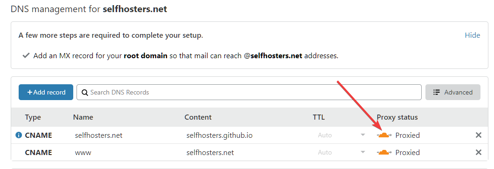
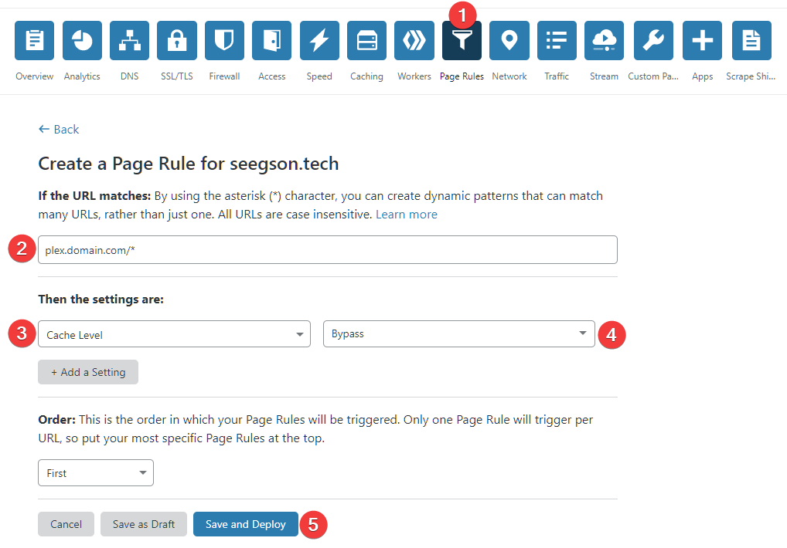

# Routing Plex through Cloudflare

## Why

Routing Plex through the [Cloudflare CDN](https://www.cloudflare.com/learning/cdn/what-is-a-cdn/) can vastly improve your remote connection speeds to your server. Cloudflare acts as a middle man between your server and your different clients.

Many experience bad peering between server and client even though the server has a good upload speed. This is because the client sometimes has to hop through all sorts of hoops if it's on a different ISP network. This can increase latency and lowered connection speeds.

But by using Cloudflare as a middle man, both your server and the clients will (in most cases) have a great connection to Cloudflare.

This will speed up the start times and scrolling of your streams.

### Reverse proxy

To get this working you need to reverse proxy Plex. This guide won't go into detail on how to do this. But I highly recommend this guide as a starting point. [Let's Encrypt, Nginx & Reverse Proxy Starter Guide - 2019 Edition](https://blog.linuxserver.io/2019/04/25/letsencrypt-nginx-starter-guide/)

The [linuxserver/letsencrypt](https://hub.docker.com/r/linuxserver/letsencrypt/) container comes with premade nginx configs that you can use.
If you're stuck, just pop into the ==#reverse-proxy== channel on our [Discord](https://selfhosters.net/unraid) and someone will help you :slight_smile:

### Cloudflare

If you haven't already you need to add your domain to Cloudflare for this to work. See this guide on how to do that: [Creating a Cloudflare account and adding a website](https://support.cloudflare.com/hc/en-us/articles/201720164-Creating-a-Cloudflare-account-and-adding-a-website)

In short you need to change your nameservers on your DNS provides page to the ones Cloudflare says.
This might take some time depending on the DNS provider. Last time I did it I was using Namecheap and it took less then 10 minutes to propagate so have some patience.

After it's been transfered make sure the orange cloud is enabled. This is what activates the Cloudflare CDN on the domain.



#### Cache rules

This is very important that you do or else Cloudflare might ban your account for breaking the TOS on caching.

!!! info
    See: [2.8 Limitation on Serving Non-HTML Content](https://www.cloudflare.com/terms/)


Go to the ==Page Rules== menu and click on ==Create page rule==
You can have 3 page rules per domain.

Add your domain with a wildcard at the end like so: `plex.domain.com/*` If you're using your root domain you do the same. `domain.com/*`

If you want to add the rule on all subdomains you can do that so: `*.domain.com/`

Next select the ==Cache Level== setting and set it to ==Bypass== 
Then click ==Save and Deploy==



#### Disable IPv6

There is currently a [bug](https://forums.plex.tv/t/plex-api-sessions-status-not-honoring-x-forwarded-for-x-real-ip-with-ipv6-clients/175705) in Plex that it sees remote IPv6 adresses as local when reverse proxied. And as Cloudflare uses IPv6 we can disable that using the Cloudflare API. (It's not possible through the webUI)

This bug won't affect performance, but any remote streams using IPv6 will show as local on the Plex dashboard and in Tautili. So this is more of an annoyance that we can easily fix.

Below is the command you need to run for disabling IPv6.

```bash
    curl -X PATCH "https://api.cloudflare.com/client/v4/zones/xxxxxxxxxxxxxxxxx/settings/ipv6" \
    -H "X-Auth-Email: xxxxxxx@gmail.com" \
    -H "X-Auth-Key: xxxxxxxxxxxxxxxxxxxxx" \
    -H "Content-Type: application/json" \
    --data '{"value":"off"}'
```

In the API URL replace the x's with you Zone ID for you domain. You can find the zone ID on the ==Overview== page at the bottom.


On the second line add your email account you used for Cloudflare and on the third line add your ==Global API key==

The Global API key can be found on your profile page and then API Tokens.

Next just paste all the lines into the terminal and hit enter.

If successful, the output will look like this:

```json
    {"result":{"id":"ipv6","value":"off","modified_on":"2020-01-21T20:52:11.121560Z","editable":true},"success":true,"errors":[],"messages":[]}
```

In the webui it should now say that IPv6 Compatibility is off.


### Plex

#### Custom server access URLs

After you've setup your reverse proxy for Plex and configured Cloudflare, go into your Plex settings and select ==Network==.
Then click on ==Show Advanced== and scroll down to ==Custom server access URLs==

Add your domain you setup for plex with the port 443 after like so: `https://plexdomain.com:443` and hit save.


At this point you do not need to have ==Remote Access== enabled anymore.

To test you can disable your ==Remote Access== and try and stream something remotely.

Happy streaming :smile:
