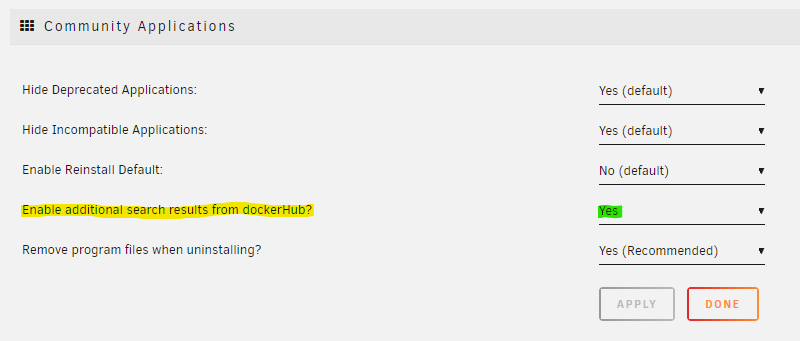
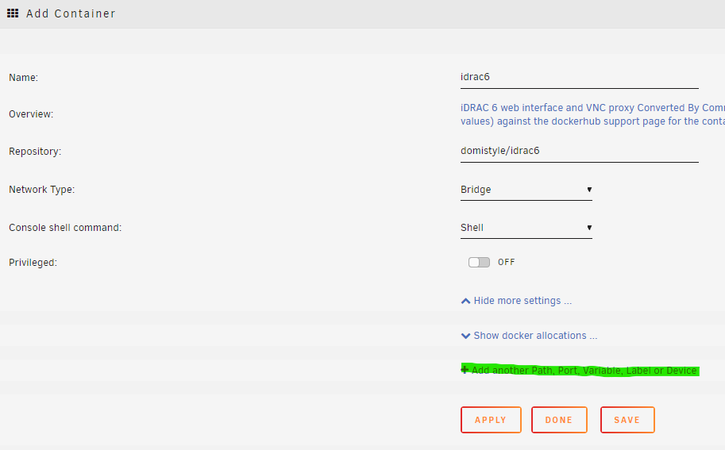
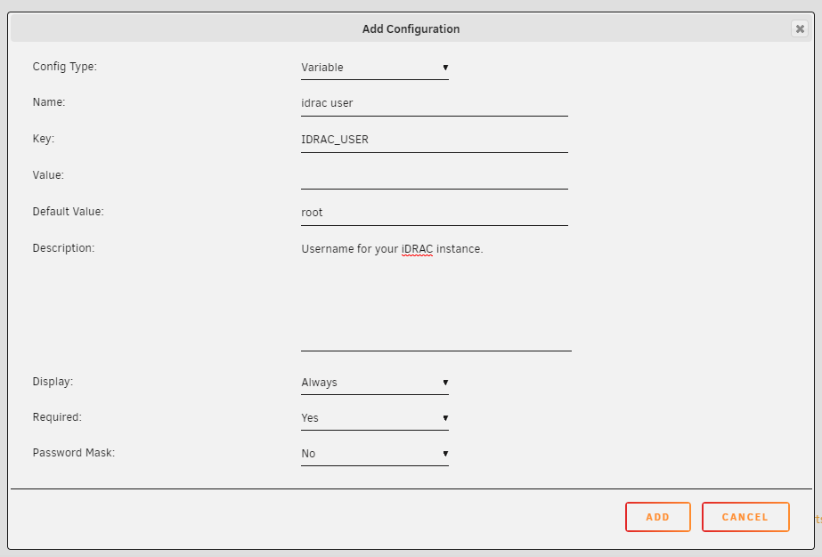
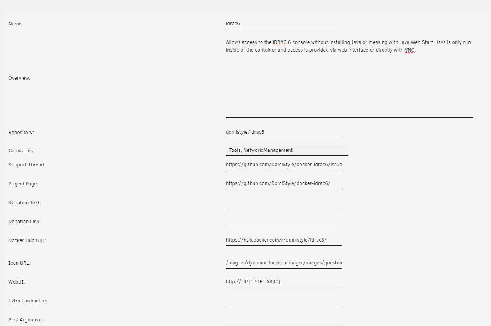

# Writing a template compatible for unraid

This is an effort to collect information from [Squids FAQ](https://forums.unraid.net/topic/57181-docker-faq/).

## 0. Enabling Template Authoring Mode

In order to have a smooth experience creating templates I highly recommend enabling `Template Authoring Mode`, it allows you to see the XML in clear-text and some other small neat tricks we might need to come back to.

This process requires you to shutdown the docker service for a short while, as unraid doesn't let us change the setting with the service running.  


When the docker service is successfully shutdown, enable advanced view.


We can now enable authoring mode, you can also toggle the docker service back on.  


## 1. Choosing which way to go

We can get started writing templates in two ways:

1. Convert a template generated by Community Application, the CA way
2. Work directly with the XML

## The CA way

### 1.1.0 Enabling search from dockerHub

In order to have Community Applications (hereby referenced as CA) generate one, we need to enable additional search from dockerHub. You do this by opening CA, and press the settings button on the sidebar.


Enable additional search.


### 1.1.1 Search from DockerHub

For this guide I will use `domistyle/idrac6` as an example. Go back to CA, and type the image you want to create a template for, in the search bar (If you get a match now, chances are, it is already in CA), and press `Get More Results From DockerHub`.


CA shows results for both the image-maintainer, and image-name. Which means that we will get similar results. Press the download to disk icon, and let CA convert it.


For this one CA didn't do a very good job in converting it (it reads the dockerfile for volumes, expose, publish etc.), however we can modify it with the template editor in Unraid.


### 1.1.2 Editing the template

To see what we need to edit, we can most often read the [readme](https://github.com/DomiStyle/docker-idrac6/blob/master/README.md#usage) of the container (including a screenshot incase the readme changes)
.

!!! note "Get to know the template editor, its very handy. Also for managing existing templates"

I'm going through the rest of this guide with a mix of views (to remove clutter from images). If some of the settings you see on a screenshot isn't showing to you, enable advanced view.


#### Variables

I will start with adding the variables, just because those are on the top of the documentation of this container.

To add the `IDRAC_HOST` variable, we are going to press the `Add annother Path, Port, Variable or Device` link.


We need to change the Config Type to Variable, then we can start adding values. There is a lot going on here, but it is all going to make sense in the end.

>==Name== The name for the variable, this is to help the user identifying what this variable does.  
>==Key== This is the actual variable, so we are putting `IDRAC_HOST` here.  
>==Value== We don't fill this, this is for the user.  
>==Default Value== We could fill this, but since we can only do a estimated guess on what a users idrac host is, we are going to skip it.  
>==Description== Usually I don't fill this field with this long of a text, but the documentation of the container had a good one, so I'm using it.  
>==Display== This decides if the "average user" (someone that isn't using advanced view) is going to see this variable.  
*TODO: add view-modes*  
>==Required== I set this to yes because I know the container wont work without it set. The fact that the documentation tells me its required also helped in the decision.  
>==Password Mask== This isn't a password, so it doesn't need to have its value masked behind asterisk (*).  


??? example "Here is some screenshots on how I added the other required variables"

    
    Here I set the Default value as root, since I know that's the default username on idrac  

    
    Here I set the Default value as calvin, since I know that's the default password on idrac, I also enabled Password Mask

#### Volumes

Next is adding the volumes. We press the same `Add annother Path, Port, Variable or Device` link, but we don't need to change the config type this time.
The fields we can add here is mostly the same, but in "Volume" mode some of them are voided. like password mask.

If it's a "proper" appdata location, I set required to yes

>==Access Mode== Defines how the container should have access to this volume. Almost always read/write


#### Ports

Now its time for the ports. We press the same `Add annother Path, Port, Variable or Device` link. This time we need to change the config type to `Port`

The documentation for this container says we can use port 5800 to access the interface, so that's the port we are going to add.

>==Connection Type== Always `TCP`, unless specified otherwise


#### Metadata

Now you have a basic template. This might be enough for your own usage, but in order to add it to CA we should add some spice to the template.

As you can see there is lots of fields we can fill in with the template editor.


I'm not going to walk you trough this, but I am going to tell you how it ended up like it did.

I changed the overview to match the intro from the readme of the container.

I used the dropdown to set the categories as I saw fit.

I set the support thread as the issue page of the project.

!!! danger "Do not do this if you are creating a template for your own container, create a support thread on the unraid forums and use that link"

The project page is usually the GitHub link to the container.

I have yet to change the Icon URL, because I need to create a icon.

`WebUI` Should be filled with the *container* port, unraid should do the translation `http://[IP]:[PORT:5800]`. If this is a https enabled port, set the url to use https.

For Post arguments and Extra Parameters, you should know if you need to fill this.



### 1.1.3 Grab the XML

Once you have filled all the fields, and set the ports, variables and volumes as good as you can, you can press the `Save` button, this takes you to a page where can see the xml in plain-text. Don't worry, it also saves the xml to your OS disk. Bellow is the XML generated by the procedure above.

??? example

    ```xml
    <?xml version="1.0"?>
    <Container version="2">
    <Name>idrac6</Name>
    <Repository>domistyle/idrac6</Repository>
    <Registry>https://hub.docker.com/r/domistyle/idrac6/</Registry>
    <Network>bridge</Network>
    <MyIP/>
    <Shell>sh</Shell>
    <Privileged>false</Privileged>
    <Support>https://github.com/DomiStyle/docker-idrac6/issues</Support>
    <Project>https://github.com/DomiStyle/docker-idrac6/</Project>
    <Overview>Allows access to the iDRAC 6 console without installing Java or messing with Java Web Start. Java is only run inside of the container and access is provided via web interface or directly with VNC.</Overview>
    <Category>Tools: Network:Management</Category>
    <WebUI>http://[IP]:[PORT:5800]</WebUI>
    <TemplateURL/>
    <Icon>/plugins/dynamix.docker.manager/images/question.png</Icon>
    <ExtraParams/>
    <PostArgs/>
    <CPUset/>
    <DateInstalled>1579532295</DateInstalled>
    <DonateText/>
    <DonateLink/>
    <Description>Allows access to the iDRAC 6 console without installing Java or messing with Java Web Start. Java is only run inside of the container and access is provided via web interface or directly with VNC.</Description>
    <Networking>
        <Mode>bridge</Mode>
        <Publish>
        <Port>
            <HostPort/>
            <ContainerPort>5800</ContainerPort>
            <Protocol>tcp</Protocol>
        </Port>
        </Publish>
    </Networking>
    <Data>
        <Volume>
        <HostDir/>
        <ContainerDir>/vmedia</ContainerDir>
        <Mode>rw</Mode>
        </Volume>
        <Volume>
        <HostDir/>
        <ContainerDir>/app</ContainerDir>
        <Mode>rw</Mode>
        </Volume>
        <Volume>
        <HostDir/>
        <ContainerDir>/screenshots</ContainerDir>
        <Mode>rw</Mode>
        </Volume>
    </Data>
    <Environment>
        <Variable>
        <Value/>
        <Name>IDRAC_HOST</Name>
        <Mode/>
        </Variable>
        <Variable>
        <Value/>
        <Name>IDRAC_USER</Name>
        <Mode/>
        </Variable>
        <Variable>
        <Value/>
        <Name>IDRAC_PASSWORD</Name>
        <Mode/>
        </Variable>
        <Variable>
        <Value/>
        <Name>IDRAC_PORT</Name>
        <Mode/>
        </Variable>
        <Variable>
        <Value>false</Value>
        <Name>IDRAC_KEYCODE_HACK</Name>
        <Mode/>
        </Variable>
        <Variable>
        <Value>99</Value>
        <Name>USER_ID</Name>
        <Mode/>
        </Variable>
        <Variable>
        <Value>100</Value>
        <Name>GROUP_ID</Name>
        <Mode/>
        </Variable>
    </Environment>
    <Labels/>
    <Config Name="idrac host" Target="IDRAC_HOST" Default="" Mode="" Description="Host for your iDRAC instance. Make sure your instance is reachable with https://&amp;lt;IDRAC_HOST&amp;gt;. See IDRAC_PORT for using custom ports. HTTPS is always used." Type="Variable" Display="always" Required="true" Mask="false"/>
    <Config Name="idrac user" Target="IDRAC_USER" Default="root" Mode="" Description="Username for your iDRAC instance." Type="Variable" Display="always" Required="true" Mask="false"/>
    <Config Name="idrac password" Target="IDRAC_PASSWORD" Default="calvin" Mode="" Description="Password for your iDRAC instance." Type="Variable" Display="always" Required="true" Mask="true"/>
    <Config Name="WebUI" Target="5800" Default="5800" Mode="tcp" Description="web interface port" Type="Port" Display="always" Required="true" Mask="false"/>
    <Config Name="idrac port" Target="IDRAC_PORT&#9;" Default="443" Mode="" Description="The optional port for the web interface." Type="Variable" Display="advanced-hide" Required="false" Mask="false"/>
    <Config Name="keyboard fix" Target="IDRAC_KEYCODE_HACK" Default="false|true" Mode="" Description="If you have issues with keyboard input, try setting this to true." Type="Variable" Display="advanced-hide" Required="false" Mask="false">false</Config>
    <Config Name="PUID" Target="USER_ID" Default="" Mode="" Description="PUID" Type="Variable" Display="advanced" Required="false" Mask="false">99</Config>
    <Config Name="PGID" Target="GROUP_ID" Default="" Mode="" Description="PGID" Type="Variable" Display="advanced" Required="false" Mask="false">100</Config>
    <Config Name="Virtual media" Target="/vmedia" Default="/mnt/user/appdata/idrac/vmedia" Mode="rw" Description="Can be used to allow virtual media to be mounted." Type="Path" Display="advanced" Required="false" Mask="false"/>
    <Config Name="Libraries" Target="/app" Default="/mnt/user/appdata/idrac/app" Mode="rw" Description="Libraries downloaded from your iDRAC instance will be stored here. Add a volume to cache those files for a faster container startup." Type="Path" Display="advanced" Required="false" Mask="false"/>
    <Config Name="Screenshots" Target="/screenshots" Default="/mnt/user/appdata/idrac/screenshots" Mode="rw" Description="Container Path: /screenshots" Type="Path" Display="advanced" Required="false" Mask="false"/>
    </Container>
    ```
